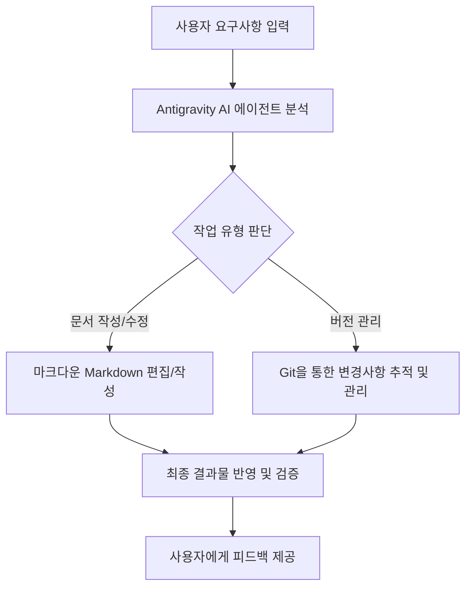

# Project Mechanism

```mermaid
flowchart TD
    A[사용자 요구사항 입력] --> B[Antigravity AI 에이전트 분석]
    B --> C{작업 유형 판단}
    C -->|문서 작성/수정| D[마크다운 Markdown 편집/작성]
    C -->|버전 관리| E[Git을 통한 변경사항 추적 및 관리]
    D --> F[최종 결과물 반영 및 검증]
    E --> F
    F --> G[사용자에게 피드백 제공]
```
